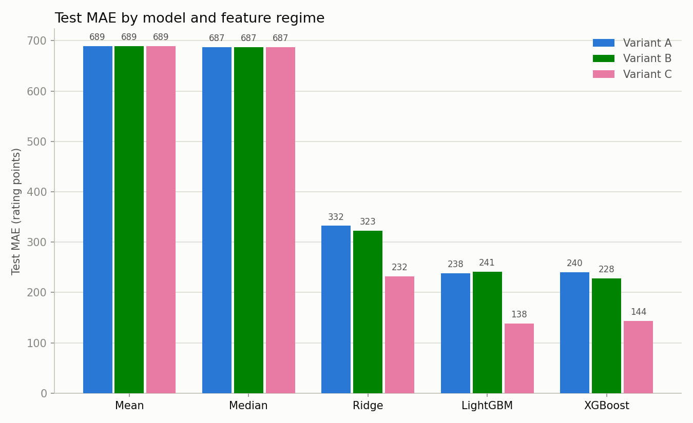
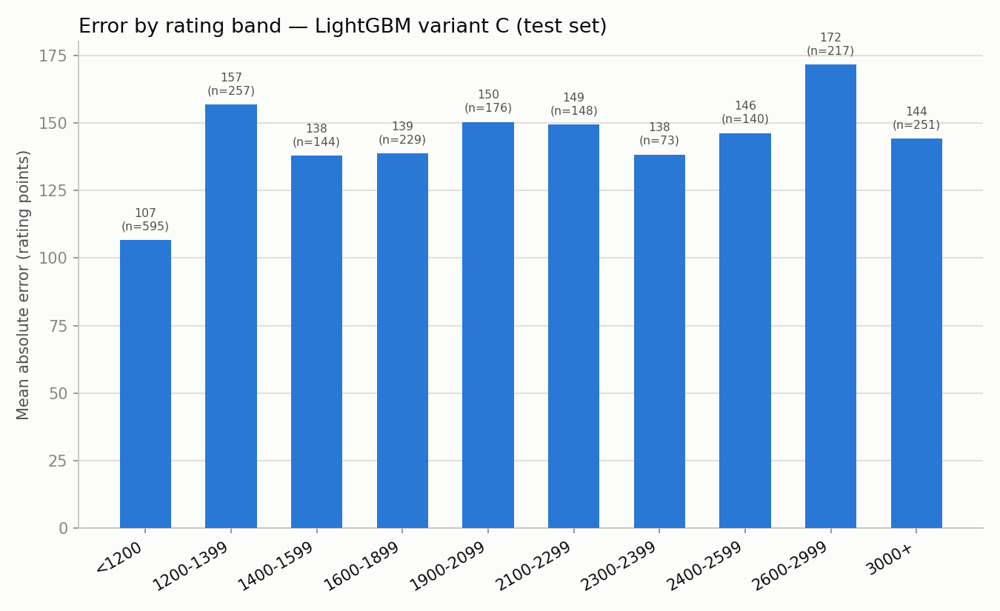

# Experiment Report

## 1. Research Question

How accurately can the published difficulty rating of a Codeforces problem be
predicted from structured metadata, and how much incremental predictive value
is contributed by tags and solve statistics?

## 2. Dataset

Collected from the Codeforces API (`problemset.problems` + `contest.list`,
non-gym) on **2026-04-22**.

- Total PROGRAMMING problems: 11,155
- Labeled (rating known): 10,864 (97.4%) — used for supervised training/eval
- Unlabeled (no rating): 291 (2.6%) — excluded, no target to fit
- Contests represented: 1,973
- Rating range: 800-3500; 0 out-of-range values flagged
- Missing `points`: 3,622 (33.3%) of labeled rows — not used as a feature
- Missing `base_index`: 14 (0.1%)
- Tag coverage: 10,702 problems with ≥1 tag, 162 with none, 38 unique tags,
  mean 2.88 tags/problem
- No duplicate `(contestId, index)` rows after merging — 0 dropped

Rating distribution (labeled): <1200 = 20.5%, 1200-1599 = 16.8%,
1600-1999 = 18.8%, 2000-2399 = 16.6%, 2400+ = 27.3%. Reasonably balanced across
bands, with a slight skew toward the hardest bucket.

**Split:** contests sorted ascending by `startTimeSeconds`, then bucketed
70/15/15 by contest count — train = 6,961 problems / 1,351 contests,
val = 1,844 / 289, test = 2,059 / 291. Every problem from a contest stays in
one split, so no contest (and no near-duplicate div1/div2-mirrored problem)
leaks across train/val/test. This is a chronological holdout, not a random
one: test is strictly the most recent 15% of contests.

## 3. Models

- **Mean / Median** — ignore all features, predict the training-set mean/median
  rating. Establishes the floor any real model must beat.
- **Ridge** — `StandardScaler` + Ridge regression (α=10). Linear baseline;
  captures additive effects of one-hot/numeric features only.
- **LightGBM** — gradient-boosted trees (500 estimators, depth 8, 64 leaves).
  Primary model; handles non-linear interactions (e.g. division x index) natively.
- **XGBoost** — gradient-boosted trees (500 estimators, depth 8, `hist` method).
  Comparison point for LightGBM.

All 5 model types are trained on each of the 3 feature regimes (A/B/C) = 15
artifacts, selected by validation MAE.

## 4. Metrics

MAE (headline — directly interpretable in rating points), RMSE, R², median
absolute error, and % of predictions within ±100 / ±200 rating points.

## 5. Results

Full test-set comparison, sorted by MAE (also in
[`reports/model_comparison.md`](model_comparison.md) /
[`metrics.json`](metrics.json)):

| Model | Variant | MAE | RMSE | R² | MedAE | Within±100 | Within±200 |
|---|---|---:|---:|---:|---:|---:|---:|
| lgbm | C | 138.5 | 187.0 | 0.947 | 109.6 | 47.0% | 76.3% |
| xgb | C | 143.7 | 191.5 | 0.944 | 113.4 | 45.5% | 74.2% |
| xgb | B | 228.2 | 322.7 | 0.842 | 167.0 | 33.8% | 56.1% |
| ridge | C | 231.8 | 283.9 | 0.878 | 208.6 | 22.9% | 48.6% |
| lgbm | A | 238.3 | 340.9 | 0.824 | 171.9 | 34.1% | 56.0% |
| xgb | A | 240.4 | 365.4 | 0.797 | 160.7 | 36.4% | 55.7% |
| lgbm | B | 241.0 | 332.7 | 0.832 | 179.0 | 31.8% | 54.5% |
| ridge | B | 322.8 | 419.6 | 0.733 | 268.3 | 19.5% | 38.5% |
| ridge | A | 332.5 | 431.9 | 0.717 | 249.3 | 16.0% | 33.5% |
| median | A/B/C | 687.4 | 815.0 | -0.008 | 700.0 | 12.8% | 19.7% |
| mean | A/B/C | 689.3 | 811.7 | 0.000 | 680.1 | 8.8% | 16.3% |

Best model: **LightGBM, Variant C (popularity-aware)** — MAE 138.5, R² 0.947.

## 6. Error Analysis

**Does the model overpredict easy problems?** Somewhat. Mean *signed* error
(pred - true) on the best model is **+90.5** overall — a persistent positive
bias, not just symmetric noise. It's smallest in the easiest band (<1200:
+84.7) but still positive there, and stays in the +85 to +125 range through
1200-2999.

**Does it underpredict hard problems?** Only at the very top: the 3000+ band
is the one place the bias flips, to **-36.5** (mean abs error still 144.2 there,
n=251). Everywhere below 3000 the model tends to guess *higher* than the true
rating, not lower — so "underpredicts hard problems" only holds for the
extreme tail, not the 2400-2999 range.

**Which divisions/indices have the highest error?** By division (MAE): ICPC
187.7 (n=226) and Div. 4 179.8 (n=110) are worst; Div. 3 111.8 (n=356) and
Div. 2 123.7 (n=799) are best. By base problem index, error rises steadily
with position: A = 72.5 (n=294) up to L = 243.7 (n=11) — later-lettered
problems are both rarer and much harder to predict, consistent with the
metadata-only finding that problem index carries most of the signal for early
problems but the tail (G+) is noisier and thinner.

## 7. Interpretation

- Problem index and division provide most of the predictive power in the
  metadata-only setting (Variant A gets to MAE 238 with LightGBM, versus 687
  for the median baseline) — position in the contest is doing a lot of work
  before any tag or solve-count information is added.
- Tags produced no measurable improvement for LightGBM (238.3 → 241.0, worse)
  and only a moderate one for XGBoost (240.4 → 228.2); tags alone did not
  resolve the growing error at the high-rating tail (G+ indices, 2600-2999 band).
- The popularity-aware model (Variant C) obtained the lowest MAE by a wide
  margin (138.5 vs. ~230-240 for A/B), but `solvedCount` is retrospective —
  it accumulates over the problem's entire lifetime, not just the contest
  window, so this gain reflects post-publication information rather than a
  same-day, post-contest signal.
- The persistent positive bias (+90 points on average, flipping to -36 only
  above 3000) suggests a systematic effect beyond random error — plausibly
  rating-convention drift over time, since the split is chronological and test
  is strictly the newest 15% of contests. This is worth a dedicated check
  before trusting the model's absolute output, not just its ranking.

## 8. Limitations

- The target is the Codeforces-assigned rating, an imperfect proxy for
  intrinsic problem difficulty, not a ground-truth measurement.
- Predictions use structured metadata only; problem statements are not
  inspected.
- `solvedCount` (Variant C) includes practice/virtual submissions accumulated
  after the original contest; older problems have had more time to accrue
  solves, so Variant C should be read as popularity-aware/retrospective.
- Contest division and problem index encode organizer expectations and appear
  to dominate more semantically meaningful features (tags moved the needle
  very little on top of them).
- The chronological test split — while methodologically the right choice to
  avoid leakage — means results are also sensitive to any rating-convention
  drift between the training era and the test era; the observed sign flip in
  bias above 3000 rating is consistent with this.
- Sample sizes shrink sharply at both distribution tails (e.g. index L:
  n=11, rating band 2300-2399: n=73), so per-bucket estimates there are noisy.
- Results may not generalize to other competitive-programming platforms.
